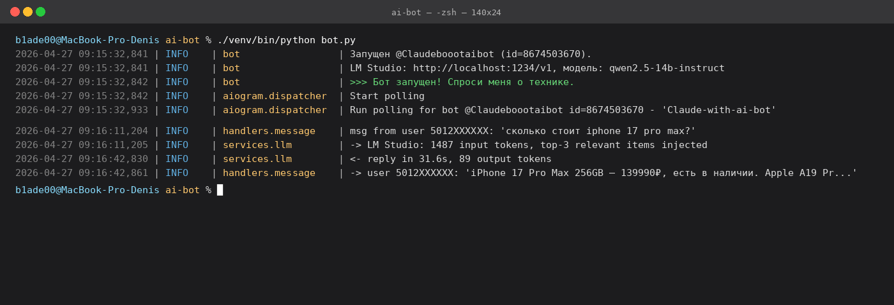

# 🛒 Tech Store AI Bot

A Telegram consultant bot for an offline electronics store. It takes natural-language questions from customers ("how much is the iPhone 17 Pro?", "any push-button phones under 3000₽?", "recommend me a smartphone under 25K") and answers using a **fully local LLM** — no data ever leaves the machine.

> [README на русском →](README.md)

---

## 🎬 Demo



_What it looks like under the hood: the bot takes the user's text, assembles a compact prompt (~1500 input tokens), hits the local LM Studio, returns a short human reply ~30 seconds later. Video demo of the actual Telegram dialogue is coming to `docs/demo.gif`._

```
Customer: How much is a Redmi A5 128GB?
Bot:      Xiaomi Redmi A5 — 8490₽, in stock. Basic smartphone,
          dual SIM, 6.7" HD+. Solid call-and-text phone for the price.
```

---

## ✨ Features

- Understands plain language — no commands required
- Runs on a **local LLM** (Qwen 2.5 14B Instruct via LM Studio) — zero API cost, full privacy
- Strictly grounded in the real store catalog — never hallucinates prices or models
- Dynamically injects only the relevant items into the prompt; the rest of the catalog is sent as one-line summaries
- Replies in a human tone: 1–3 short sentences, no bullet lists, no corporate filler
- Hides internal IDs, tags, stock counts and category labels from the customer

---

## 🧰 Stack

- **Python 3.13** + `asyncio`
- **aiogram 3** — Telegram bot framework
- **OpenAI Python SDK** — talks to LM Studio over its OpenAI-compatible API
- **LM Studio** + **Qwen 2.5 14B Instruct (Q4_K_M)** — local LLM
- **python-dotenv** — config via `.env`
- **dataclasses + JSON** — catalog as a flat structure (no DB needed for ~70 SKUs)

Runs on a MacBook Pro M1 16 GB. Resident memory ~9–10 GB with the model loaded.

---

## 🏗 Architecture

```
┌────────────┐    text    ┌─────────────────┐
│  Telegram  ├──────────▶│  handlers/       │
│   client   │           │  message_handler │
└────────────┘           └────────┬─────────┘
                                  │ user_text
                                  ▼
                         ┌──────────────────┐
                         │ services/        │
                         │ llm_service      │◀─── system prompt
                         └────────┬─────────┘     + compact catalog
                                  │ chat.completions  + relevant details
                                  ▼
                         ┌──────────────────┐
                         │ LM Studio        │
                         │ (localhost:1234) │
                         └──────────────────┘
```

```
ai-bot/
├── bot.py                       # entry point: Bot, Dispatcher, polling
├── config.py                    # .env loading, token validation
├── handlers/
│   └── message_handler.py       # /start, /help, /catalog, free-text
├── services/
│   ├── llm_service.py           # LM Studio client, retries, prompt build
│   └── product_service.py       # catalog load, search, formatting
├── prompts/
│   └── system_prompt.txt        # tone + behaviour rules
├── data/
│   └── products.json            # 72 items: phones, push-button, tablets, watches, audio
├── requirements.txt
├── .env.example
└── README.en.md
```

---

## 🚀 Setup

### 1. Dependencies

Python 3.11+ required. A Mac is recommended — Qwen 2.5 14B uses Metal acceleration through LM Studio.

```bash
git clone https://github.com/<your-user>/ai-bot.git
cd ai-bot
python3 -m venv venv
source venv/bin/activate
pip install -r requirements.txt
```

### 2. LM Studio

1. Install LM Studio from [lmstudio.ai](https://lmstudio.ai)
2. Search and download `qwen2.5-14b-instruct` (Q4_K_M, ~9 GB)
3. Open Developer → Local Server → **Start Server**
4. Load the model with:
   - Context Length: **4096** (max for 16 GB Mac)
   - Max Concurrent Predictions: **1**
   - GPU Offload: max

API will be available at `http://localhost:1234/v1`.

### 3. Telegram bot

1. Open [@BotFather](https://t.me/BotFather), `/newbot` — get the token
2. Copy the config and paste your token:
   ```bash
   cp .env.example .env
   # edit .env: TELEGRAM_TOKEN=...
   ```

### 4. Run

```bash
./venv/bin/python bot.py
```

You should see `✅ Bot started!`. Open the chat in Telegram and start typing.

---

## 📦 Catalog

Lives in `data/products.json`. One record:

```json
{
  "id": "phn-ap-001",
  "name": "iPhone 17 Pro Max 256GB",
  "category": "смартфон",
  "price_rub": 139990,
  "stock": 4,
  "specs": "Apple A19 Pro, 6.9\" ProMotion OLED, triple 48MP, USB-C, titanium",
  "tags": ["ios", "flagship", "camera", "apple", "iphone"]
}
```

After editing the catalog, restart the bot (`Ctrl+C`, then `python bot.py`). System prompt and catalog are cached at startup via `@lru_cache`.

---

## 🧠 How the prompt works

For every user message the bot assembles three blocks:

1. **Base prompt** (`prompts/system_prompt.txt`) — tone and behaviour rules. E.g. "never suggest an alternative unless the customer asked", "never mention stock counts".
2. **Compact catalog** — all 70+ items, one line each: `iPhone 17 Pro Max 256GB — 139990₽ (есть)`. Gives the model the full assortment without burning tokens.
3. **Relevant details** — a naive substring search picks the top-3 matches and inserts them with full specs. The model answers to the point instead of regurgitating the whole catalog.

Result: ~1500 input tokens per request instead of 4000+ in the "dump everything" approach. Reply latency on M1 Pro 16 GB: 20–60 seconds (bottleneck is prompt processing for a 14B model).

---

## 🐛 Troubleshooting

**Bot not replying, log spams `Retrying request to /chat/completions`** — the model is still chewing through prompt processing. On 14B + 16 GB the first answer is slow but does arrive. `LM_STUDIO_TIMEOUT=600` in `.env`.

**`LM Studio unavailable`** — open LM Studio, check Status: Running and that the model is loaded.

**Bot quotes USD prices / old models** — you didn't restart the bot after editing the catalog.

**RAM saturated** — eject the model and reload with Context Length 4096 and Max Concurrent Predictions 1. Saves up to 3 GB.

---

## 🛣 Roadmap

- [ ] Conversation memory (last N messages per chat)
- [ ] Admin commands: `/add_product`, `/edit_stock`
- [ ] Vector search over catalog (sentence-transformers + FAISS) instead of substring match
- [ ] Product images (`InputMediaPhoto` attached to replies)
- [ ] Metrics: questions/day, top-asked items, average dialog length
- [ ] Unit tests for handlers and product_service
- [ ] Docker-compose: LM Studio API + bot in one command
- [ ] 1C / Excel stock export integration

---

## 📄 License

[MIT](LICENSE).

---

## 🙋‍♂️ Author

Denis, fullstack junior. Built this for a family-owned electronics store. If you're hiring juniors, get in touch: [your-telegram / email].
